==Canvas

Canvas sử dụng JavaScript để vẽ đồ họa trực tiếp trên trang web. Canvas giúp hiển thị trực quan một số hình ảnh dễ dàng trên trình duyệt như các bản vẽ, các album ảnh, các biểu đồ, các đồ thị, các hình ảnh động, và các ứng dụng bản vẽ nhúng. Với Canvas bạn có thể vẽ tất cả các loại đồ họa, từ đường nét đơn giản tới các đối tượng đồ họa phức tạp.

* Cú pháp: Một canvas được xác định bằng tag "canvas".<br>

```html
<canvas id="myCanvas" width=".." height=".." boder= ".."></canvas>
```
Chú ý: Trạng thái mặc định của canvas là width=300px, height=150px, không đường viền và không nội dung. Luôn xác định id của canvas để JavaScript có thể tham chiếu tới. Có thể thêm CSS: width, height, border.

Các tọa độ canvas:
- Các góc trên bên trái có x=0, y=0.
- Giá trị x tăng theo chiều ngang.
- Giá trị y tăng theo chiều dọc.
- Góc dưới cùng bên phải có x=width, y=height.
- Tâm điểm có x=width/2, y=height/2.

Để bắt đầu vẽ JavaScript phải:
- Xác định phần tử canvas:

```html
var canvas = document.getElementById("myCanvas");
```

- Xác định ngữ cảnh:

```html
var context = canvas.getContext("2d");
```
I. Một số hình vẽ cơ bản

(1). Đoạn thẳng(Line)

Để vẽ đoạn thẳng trên Canvas sử dụng các phương thức sau:
- beginPath(): xác định bắt đầu một đoạn thẳng mới
- moveTo(): xác định điểm đầu cho đoạn thẳng này
- lineTo(): xác định điểm cuối cho đoạn kẻ này
- stroke(): thực sự vẽ đường kẻ này trên canvas

Cú pháp:

```html
<script>
context.beginPath();
context.moveTo(x,y);
context.lineTo(x,y);
context.stroke(x,y);
</script>
```

Ví dụ:

```html
<script>
var canvas = document.getElementById("myCanvas");
var context = canvas.getContext("2d");
context.moveTo(0,0);
context.lineTo(200,100);
context.stroke();
</script>
```

Minh họa:


(2). Hình chữ nhật(Rectangle)

Để vẽ hình chữ nhật trên Canvas sử dụng các phương thức sau:
- fillRect(x,y,width,height): vẽ một hình chữ nhật
- strokeRect(x,y,width,height): chỉ vẽ nét ngoài của một hình chữ nhật
- clearRect(x,y,width,height): xóa vùng cụ thể, làm cho vùng đó hoàn toàn trong suốt

Cú pháp:

```html
<script>
context.beginPath();
context.moveTo(x,y);
context.lineTo(x,y);
context.stroke(x,y);
</script>
```

Ví dụ:

```html
<script>
var canvas = document.getElementById("myCanvas");
var context = canvas.getContext("2d");
context.fillRect(25,25,50,50);
context.clearRect(35,35,30,30);
context.strokeRect(100,45,50,50);
context.fillRect(170,25,50,50);
</script>
```
Minh họa:

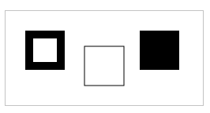

(3). Hình tròn(Circle)

Để vẽ hình tròn trên Canvas sử dụng các phương thức beginPath(), stroke() và arc(x,y,r,start,stop) trong đó:
- x, y: tọa độ của tâm hình tròn
- r: bán kính của hình tròn
- start, stop: điểm đầu và điểm cuối của cung tính bằng radian

Cú pháp:

```html
<script>
context.beginPath();
context.arc(x,y,r,start,stop);
context.stroke(x,y);
</script>
```

Ví dụ: hình tròn

```html
<script>
var canvas = document.getElementById("myCanvas");
var context = canvas.getContext("2d");
context.beginPath();
context.arc(50,50,35,0,2*Math.PI);
context.stroke();
</script>
```

Minh họa:

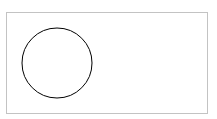

Ví dụ: hình cung

```html
<script>
var canvas = document.getElementById("myCanvas");
var context = canvas.getContext("2d");
context.beginPath();
context.arc(50,50,35,0.2*Math.PI,1.5*Math.PI);
context.stroke();
</script>
```

Minh họa:

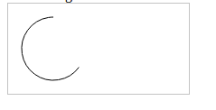

II. Một số phép biến đổi

(1). translate()

Phương thức translate(x, y): dùng để đi chuyển các mục trên canvas đến điểm khác có tọa độ (x,y).

Ví dụ:

```html
<script>
var canvas = document.getElementById("myCanvas");
var context = canvas.getContext("2d");
context.translate(0, canvas.height/2);
context.fillStyle="blue";
context.fillRect(0,0,100,50);
</script>
```

Minh họa:
- trước khi translate()

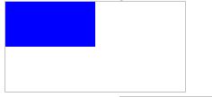

- sau khi translate()

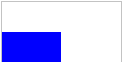

(2). scale()

Phương thức scale(x, y): thay đổi kích thước của một ảnh(x xác định rõ hệ số tỷ lệ theo chiều ngang, y xác định rõ hệ số tỷ lệ theo chiều dọc)

Ví dụ:

```html
<script>
var canvas = document.getElementById("myCanvas");
var context = canvas.getContext("2d");
context.scale(2,0.5);
context.fillStyle="blue";
context.fillRect(0,0,100,50);
</script>
```

Minh họa:
- trước khi scale()

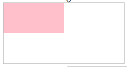

- sau khi scale()

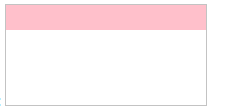

(3). rotate()

Phương thức rotate(angle): quay đổi một đối tượng dựa theo góc đã định.

Ví dụ:

```html
<script>
var canvas = document.getElementById("myCanvas");
var context = canvas.getContext("2d");
context.rotate(-Math.PI/4);
context.fillStyle="blue";
context.fillRect(-30,70,100,50);
</script>
```

Minh họa:
- trước khi rotate()

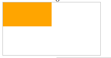

- sau khi rotate()

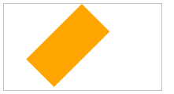

III. Gradients

(1). createLinearGradient()
- Phương thức createLinearGradient(x0,y0,x1,y1): tạo ra một gradien dọc theo một đường thẳng được xác định bởi hai điểm: (x0,y0) và (x1,y1) là điểm đầu và điểm cuối của gradien
- Phương thức addcolorStop(offset, color): offset có giá trị từ 0 đến 1, dùng để xác định vị trí của dải màu color, là quá trình chuyển tiếp sang màu bên cạnh bắt đầu. Giá trị 0, 1 là giá trị 2 đầu của gradien.

Ví dụ:

```html
<script>
var canvas = document.getElementById("myCanvas");
var context = canvas.getContext("2d");
var gradient = context.createLinearGradient(0,0,200,0);
gradient.addColorStop(0,"red");
gradient.addColorStop(1,"white");
context.fillStyle = gradient;
context.fillRect(5,5,150,90);
</script>
```

Minh họa:

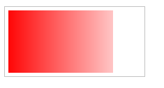

(2). createRadialGradient()
- Phương thức createRadialGradient(x0,y0,r0,x1,y1,r1): tạo ra một gradien tròn

-(x0,y0): tâm của hình tròn đầu tiên
-r0: bán kính của hình tròn đầu tiên
-(x1,y1): tâm của hình tròn thứ hai
-r1: bán kính của hình tròn thứ hai
- Phương thức addcolorStop(offset, color)

Ví dụ:

```html
<script>
var canvas = document.getElementById("myCanvas");
var context = canvas.getContext("2d");
var gradient = context.createRadialGradient(75,50,10,90,60,100);
gradient.addColorStop(0,"yellow");
gradient.addColorStop(1,"green");
context.fillStyle = gradient;
context.fillRect(5,5,150,90);
</script>
```

Minh họa:

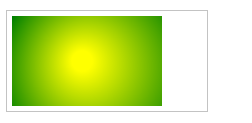

IV. Text

Để vẽ văn bản trên một canvas, sử dụng các phương thức:
- font: xác định font chữ
- strokeText (text, x, y): vẽ text bắt đầu từ tọa độ (x,y) dạng rỗng
- fillText (text, x, y: vẽ text bắt đầu từ tọa độ (x,y) dạng đặc

Ví dụ: strokeText()

```html
<script>
var canvas = document.getElementById("myCanvas");
var context = canvas.getContext("2d");
context.font = "30px Arial";
context.strokeText("March Vu",10,50);
</script>
```

Minh họa:

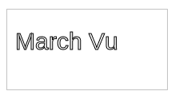

Ví dụ: fillText()

```html
<script>
var canvas = document.getElementById("myCanvas");
var context = canvas.getContext("2d");
context.font = "30px Arial";
context.fillText("March Vu",10,50);
</script>
```

Minh họa:

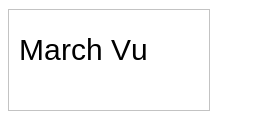

V. Image

Để thay đổi ảnh trên canvas sẽ sử dụng phương thức drawImage().
- Phương thức drawImage(image, x, y): vẽ ảnh này trên canvas ở tọa độ đích (x, y)

Ví dụ:

```html
<script>
window.onload = function() {
  var canvas = document.getElementById("myCanvas");
  var context = canvas.getContext("2d");
  var img = document.getElementById("image");
  context.drawImage(img, 10, 10);
}
</script>
```

Minh họa:

Image:


Canvas:

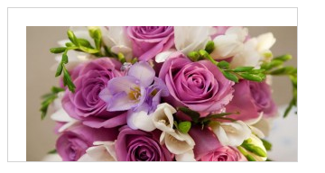

- Phương thức drawImage(image, x, y, w, h): vẽ ảnh này trên canvas ở tọa độ đích (x, y) với width = w, height = h.

Ví dụ:

```html
<script>
window.onload = function() {
  var canvas = document.getElementById("myCanvas");
  var context = canvas.getContext("2d");
  var img = document.getElementById("image");
  context.drawImage(img, 10, 10, 100, 200);
}
</script>
```

Minh họa:

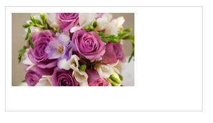

- drawImage(image, x1, y1, w1, h1, x2, y2, w2, h2): cắt ảnh này, lấy phần vùng ảnh hình chữ nhật có tọa độ đầu (x1,y1) chiều rộng w1, chiều cao h1 đi chuyển đến tọa độ đích (x2,y2) thay đổi với chiều rộng w2, chiều cao h2.

Ví dụ:

```html
<script>
window.onload = function() {
  var canvas = document.getElementById("myCanvas");
  var context = canvas.getContext("2d");
  var img = document.getElementById("image");
  context.drawImage(img, 50, 50, 100, 150, 10, 10, 200, 240);
}
</script>
```

Minh họa:

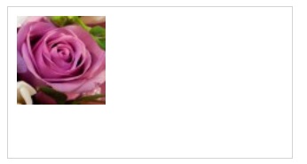
